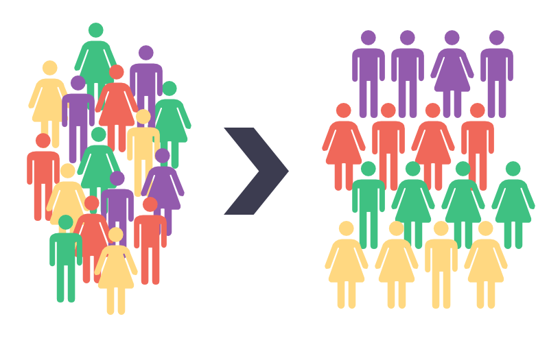
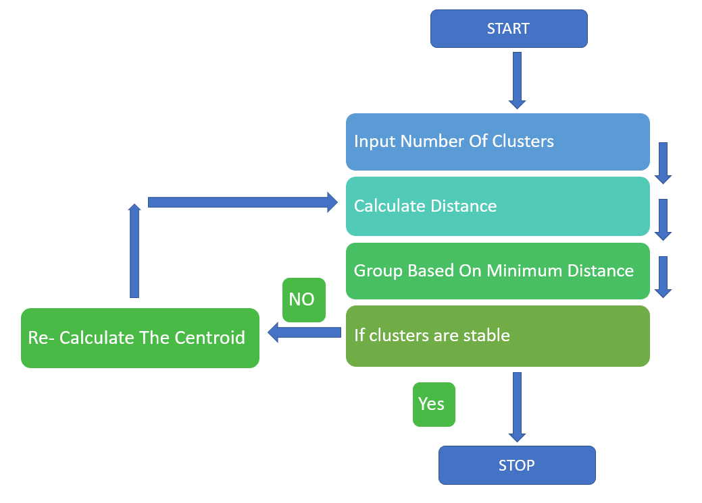
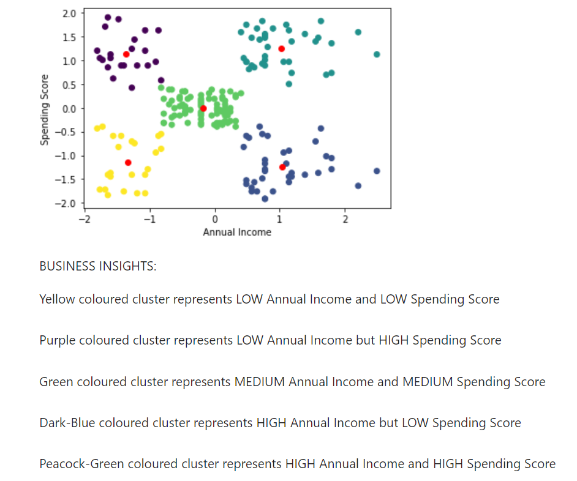
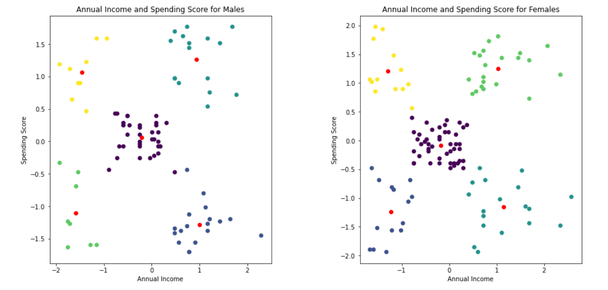

# Customer-Segmentation-using-KMeans
Customer Segmentation for Retail Industry using Unsupervised Learning (K-Means Clustering Algorithm)

## What is the Dataset about:
The dataset contains information about certain customers from a Mall. Following are the attributes of the dataset: 
CustomerID: Unique id of customer 
Genre: Gender of the customer (Male/Female) 
Age: Age of the customer 
Annual Income (k$): Annual income of the customer in k$ 
Spending Score (1-100): Score (out of 100) given to a customer by the mall authorities, based on the money spent and the behavior of the customer.

## Aim of the Project:
The aim of the project is to analyze data and find patterns within the customers, cluster the customers on the basis of these patterns. 
Part 1: Create clusters for alike customers using the data, and develop business insights depending on their annual incomes and spending scores. 
Part 2: Segreate customers as per their gender (column: Genre), and develop business insights.

## Approach used:
Type of Machine Learning problem: Unsupervised Learning 
As we are dealing with unlabelled data, we will use Unsupervised Learning Algorithms. We have create clusters and derive business insights from the generated clusters, thus we will use K-Means Clustering Algorithm. 
We will use following methodology for cluster creation:
1) Importing Data
2) Getting Overview of the Data
3) Selecting features: annual income and spending score column for deriving appropriate clusters
4) Data Pre-processing: Scaling if required
5) Using Elbow method to find the suitable number of clusters to be created
6) Training model using K-Means Clustering Algorithm, with number of clusters derived from Step 5
7) Generating business insights by analyzing the clusters

## Algorithm used:
We have used the following Unsupervised Learning Algorithm:

K-Means Clustering: 
K-Means Clustering groups unlabelled data into certain number of clusters. It is a centroid-based algorithm, where each cluster is associated to a centroid. Centroid represents centre of a cluster, generally the mean/average point of a cluster. The algorithm works as follows:
1) Select number K to decide the number of clusters. (K=number of clusters, we will use number of clusters, as K in later steps)
2) Select K random points from the data, as the centroids of the K clusters.
3) Assign each data point to the closest cluster i.e. minimum distance from one of the K clusters. Thus, each data point will be part of any 1 cluster.
4) Calculate new centroids for K clusters i.e. average data point for each cluster.
6) Continue Steps 3 and 4, until none of the data points get reassigned to a different cluster from the previously assigned one.
7) Once the data points are stable, we get our K clusters and our data segregated into these K clusters.

## Results:

                  
&emsp;&emsp;&emsp;&emsp;&emsp;&emsp;&emsp;&emsp;&emsp;&emsp;&emsp; (A) 
&emsp;&emsp;&emsp;&emsp;&emsp;&emsp;&emsp;&emsp;&emsp;&emsp;&emsp;&emsp;&emsp;&emsp;&emsp;&emsp;&emsp;&emsp;&emsp;&emsp;&emsp;&emsp;&emsp;&emsp;&emsp;&emsp;&emsp;&emsp;&emsp;&emsp;&emsp;&emsp;&emsp; (B)   

Using Elbow point method, we got K i.e. number of clusters=5. Cluster Analysis for the same is shown is the above left snap (A). 
We then created different clusters for Male and Female members based on Genre column, as shown in above right snap (B).

## Conclusion:
